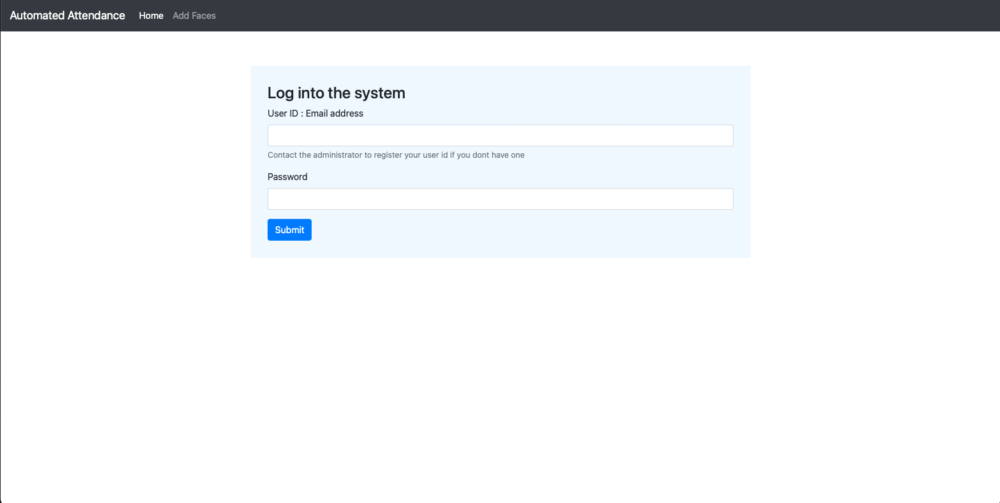
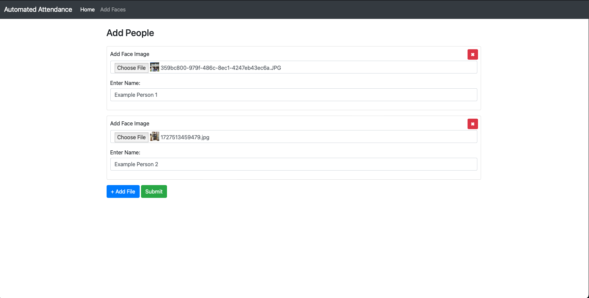
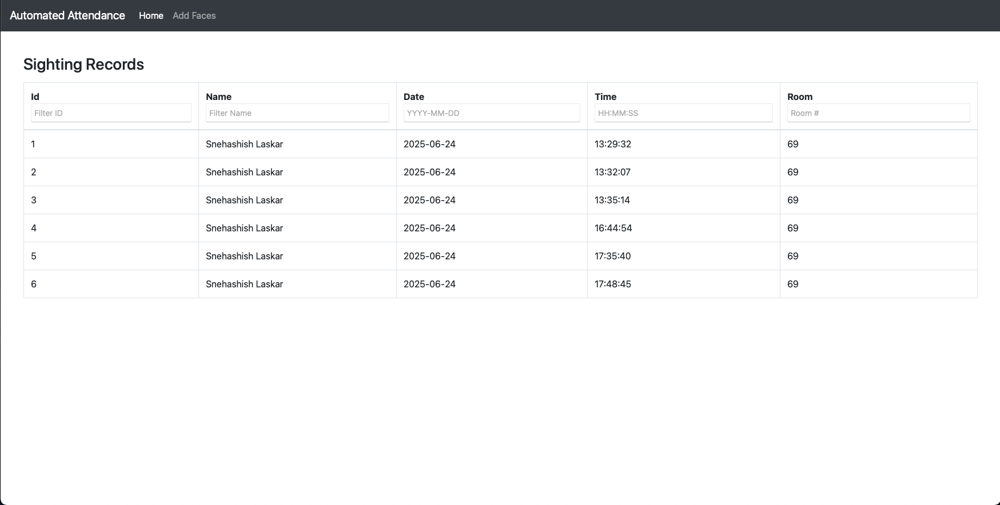

# Auto Mark - Face Tracked Attendance
### Made by Snehashish Laskar
---
Auto Mark is a tool that uses facial recognition and computer vision to process images and video input and keep track of 
student's movements from classroom to classroom.

The system assumes a central server running the Postgres SQL Database and the web interface written flask alongside multiple smaller machines installed at different rooms where the device side scripts will be executed. 

## Server Side Preperations

### Postegres SQL Database Setup
First step is to install and ready Postgres SQL on the server. This can be done as follows:

```bash
sudo apt update
sudo apt upgrade

sudo apt install postgresql postgresql-contrib
```
Next check if the installation is working and running properly.
```bash
sudo systemctl status postgresql
```
Next we login using the default postgress account and create a new operation user. 
```bash
sudo -i -u postgres
psql
```
Once we are in the postgres shell, we execute the following commands to crete the new user and new database.
```bash
CREATE USER myuser WITH PASSWORD 'mypassword';
CREATE DATABASE auto_mark OWNER myuser;
GRANT ALL PRIVILEGES ON DATABASE auto_mark TO myuser;
```
Next we run the following sql script to setup the database.
```sql
-- SEQUENCES
CREATE SEQUENCE public.admin_auth_id_seq START WITH 1 INCREMENT BY 1;
CREATE SEQUENCE public.face_profiles_id_seq START WITH 1 INCREMENT BY 1;
CREATE SEQUENCE public.sightings_id_seq START WITH 1 INCREMENT BY 1;

-- TABLE: admin_auth
CREATE TABLE public.admin_auth (
    id integer NOT NULL DEFAULT nextval('public.admin_auth_id_seq'),
    user_id text NOT NULL,
    password text NOT NULL,
    auth_level integer NOT NULL,
    PRIMARY KEY (id)
);

-- TABLE: face_profiles
CREATE TABLE public.face_profiles (
    id integer NOT NULL DEFAULT nextval('public face_profiles_id_seq'),
    name text NOT NULL,
    encoding double precision[] NOT NULL,
    PRIMARY KEY (id)
);

-- TABLE: sightings
CREATE TABLE public.sightings (
    id integer NOT NULL DEFAULT nextval('public.sightings_id_seq'),
    name text NOT NULL,
    date date NOT NULL,
    "time" time without time zone NOT NULL,
    room text NOT NULL,
    PRIMARY KEY (id)
);
```

### Setup The Admin Web Server

To setup the environment for the web server we need python 3.10 or greater. We can setup a virtual environment to install all the dependencies. 
```bash
python3 -m venv .env
source .env/bin/activate
pip3 install -r requirements.txt
```
Then we create a config.py module to store the database settings
```python
DB_HOST = ""
DB_USERNAME = ""
DB_PASSWORD = ""
DB_NAME = ""

from pathlib import Path
import os

DIRECTORY = str(Path(__file__).resolve().parent)
if not os.path.exists(DIRECTORY+"/data_set"):
    os.mkdir(DIRECTORY+"/data_set")
```
Then, create an admin user by running the file interact.py 
```bash
python3 interact.py --add-admin
```
Finally, to run the server we just need to run the following command and it will start a default flask wsgi server on your local network.
```bash
python3 server.py
```
## Client Side Preperations
Assuming we have some sort of operating installed on all the devices while being equiped with a web camera, we can setup a local python environment and run the face recognition program. 

To setup the environment for the face recognition client we need python 3.10 or greater. We can setup a virtual environment to install all the dependencies. 
```bash
python3 -m venv .env
source .env/bin/activate
pip3 install -r requirements.txt
```

Next, we create a config.py module to store the database settings. The variable ROOM NUMBER will indicate which device the requests are coming from. 
```python
DB_HOST = ""
DB_USERNAME = ""
DB_PASSWORD = ""
DB_NAME = ""
ROOM_NUMBER = ""

from pathlib import Path
import os

DIRECTORY = str(Path(__file__).resolve().parent)
if not os.path.exists(DIRECTORY+"/data_set"):
    os.mkdir(DIRECTORY+"/data_set")
```
Then to start the program we use the following command:
```bash
python3 device.py
```
## User Interface





